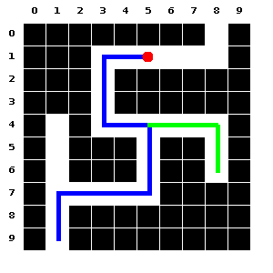

# Maze Description Language Suite: Generator and Compiler

**Maze Description Language (MDL)** is a markup language that can be used to describe mazes easily in a human readable text format. Since it is text, file sizes are very small, and therefore, these can be shared easily for collaborative and research efforts. With a small command-set and a path-based description approach, designing mazes manually is very simple requiring minimal typing. 

This suite contains two tools:
1. The MDL Compiler
1. The MDL Generator

## Build/Execution Instructions and Dependencies

Both the generator and compiler are written in Java. The pre-built JARs are available in the `build` directory and executing them requires a JVM (Oracle Java 10, version 10.0.2) to be installed. There are no other dependencies for this software. For building from source, any JVM (version 8 onwards) can be used and the Java source files are available in the `mdlc` and `mdlg` directories.

## Using the MDL generator to generate mazes

The MDL generator tool is named **MDLG** and can be invoked from the command-line. It takes 2 or more parameters. The first parameter is a **configuration file** which is typically named ``maze.config``. This will contain the various settings for the mazes that will be generated by MDLG. The names of these settings can be found in the section on the MDL language below.

To generate mazes with MDLG, we therefore need to pass the path to the configuration file followed by the paths to 1 or more output files (without extensions). Note: if the output files already exist, they will be overwritten. The number of mazes generated will be the number of output file names specified. For example, to generate 3 mazes, named: maze1, maze2, and maze3, we could execute the following command (assuming that the ``maze.config`` file exists already in the same directory):

```shell
$ java -jar mdlg.jar maze.config maze1 maze2 maze3
```

On executing the above command, 3 files: ``maze1.maze``, ``maze2.maze`` and ``maze3.maze`` will be generated, each containing a random maze as per the specifications in ``maze.config``.

## Using the MDL Compiler to generate maze code and images

The MDL Compiler is named MDLC and can be used to generate an image, or code in a high-level language, from a given maze description written in MDL. The image formats supported are: **png**, **jpg**, **tiff**, and **bmp**. Code formats supported are: **Java** and **Python**.

The compiler takes 1 or more MDL (\*.maze) files as input, and generates an output corresponding to each file. In the above example, we had generated 3 maze description files. We can now use the compiler to generate 3 PNG images from these files, as follows:

```shell
$ java -jar mdlc.jar maze1.maze maze2.maze maze3.maze
```

The above command will generate 3 maze output files, which can be either images or code depending on the settings specified inside the source files. To know how to set the output modes inside the source files, please refer to the section on the MDL language below.

## MDL Language Documentation

Every maze description file (\*.maze) contains two sections: a **settings section** followed by a **description section**. A configuration file (\*.config) contains only the **settings section**. MDL settings statements are separated by a newline character, while every description statement is terminated by a semicolon followed by a newline character.

### MDL Settings

A MDL setting takes the following form:
`[setting:value]`. The list of settings are listed in Table 1. Note that all coordinates start from 0.

**Table 1:** Table of settings supported by MDL 1.0

| Setting | Example Value | Meaning |
| ------- | --------------- | ------- |
| ``version`` | ``1.0`` | Specifies the version of the file |
| ``size`` | ``10,10`` | Specifies the no. of cells vertically & horizontally, separated by commas |
| ``unit`` | ``25`` | Specifies the size (in pixels) of each cell |
| ``output-mode`` | ``png`` | Specifies the output mode/format |
| ``entrance`` | ``c(9,1)`` | Specifies the location `c(row,col)` of the entrance |
| ``exit`` | ``c(0,8)`` | Specifies the location c(row,col) of the exit |
| ``placeholder-char`` | ``" #-*"`` | Double-quote enclosed string of 2 or 4 characters specifying placeholders for path, wall, visited and current-position markers, to be used in text mode |
| ``placeholder-int`` | ``1,0,2,3`` | 2 or 4 comma-separated integers for path, wall, visited and current-position markers to be used in text mode |
| ``visited-sprite`` | ``"path/to/sprite-image.png"`` | Specifies an image (sprite) to be used in all cells which have been visited |
| ``position-sprite`` | ``"path/to/sprite-image.png"`` | Specifies an image (sprite) to be used in the current cell |
| ``path-color`` | ``rgb(255,255,255)`` | color of the path cells |
| ``wall-color`` | ``rgb(0,0,0)`` | color of the blocked (wall) cells |
| ``position-color`` | ``rgb(255,0,0)`` | color of the circle-marker at the current position |
| ``grid-color`` | ``rgb(255,255,255)`` | the grid color separating the cells |
| ``current-position`` | ``c(9,1)`` | Specifying the current position `c(row,col)` |
| ``show-grid`` | ``true`` | A boolean value indicating whether the grid should be drawn |
| ``show-indices`` | ``true`` | A boolean value indicating whether the indices should be visible |

The ``version``, ``size`` and ``unit`` settings are compulsory, and the first line of the file must contain the version setting. All other settings are optional and if ommitted, default to predefined values. e.g. The default output mode is ``png``.

### MDL Maze Descriptions

Maze descriptions in MDL can be specified in two ways and it is recommended to use either one and not both in the same file. The two methods are the **row-method** and the **path-method**.

#### Row Method

Consider a maze with 10 rows and 10 columns. Then the rows are numbered from 0 to 9. Each row must start on a separate line and end with a semi-colon. The syntax of each row is as follows:
`r<index>:<data>;`
The `<index>` refer to the row index and can range from 0 to 9 in our example. The `<data>` is the actual row data and is a string containing only 2 types of characters: `w` or `p` representing *wall* and *path* respectively. For example, a typical row data for the 5th row for our 10x10 grid can be as follows:

```
r4:wpwwwpppww;
```

#### Path Method

The path method of specifying maze data is useful if we want to specify only the paths and not the walls. Each path information should begin on a new line and terminate with a semi-colon. The typicals syntax for such a line is as follows: `p<index>:<commencer><data>;`

The `<index>` is any unique positive integer serving as an identifier of that path. The `<data>` is the a string containing a collection of 4 direction codes: L (left), U (up), R (right) and D (down). Each of these codes can be repeated either by specifying them multiple times or by including a repeat number immediately following it, and enclosed within parenthesis. e.g. Consider the data: ``LLU(5)RRRD(7)L;`` this will mark a path by going left twice, up 5 times, then going right thrice followed by going down 7 times and finally going left once. But, following this path is impossible if we do not know our starting position. Therefore, the starting position is specified in the `<commencer>`. It can be of four types:
1. using the entrance
1. using the exit
1. using the coordinate system
1. using the path system

**1. Using the entrance:** The entrance of the maze, if specified earlier in the settings section of the maze description, can be used as a starting point of the path description by using the letter `e`. e.g. `p3:eddll;` indicates that the 3rd path begins at the entrance, goes down twice and left twice.

**2. Using the exit:** The exit of the maze, if specified earlier in the settings section of the maze description, can be used as a starting point of the path description by using the letter ``x``. e.g. ``p3:xuurr;`` indicates that the 3rd path begins at the exit, goes up twice and right twice.

**3. Using the coordinate system:** Here we specify a particular location in the maze grid using the syntax `c(<row>, <col>)` as the starting position. Note: both `<row>` and `<col>` indices start from 0.

**4. Using the path system:** Here we specify a location on another path (useful when there is a fork in a path) as the starting position, using the syntax `p(<path-index>, <index>)`. The `<path-index>` is the unique identifier of the path we are referring to, and `<index>` is the point on that path, starting from 0.

Therefore, a complete path data might look like this using the coordinate system:

```
p3:c(1,5)rrrlu(3)r;
```

The above code marks the 3rd path in the maze, beginning at the 2nd row, 6th column in the maze-grid, going right thrice from there, followed by left once, up thrice, and finally going right once. A complete path data using the path system might look like this:

```
p3:p(2,8)u(4)r(3);
```

In the above code, we mark the 3rd path in our maze, beginning at the 9th cell on the 2nd path, going up 4 times from there, and ending by going right thrice.

#### Marking paths as visited

A path or a portion of it can be marked as visited by specifying a visited-section data, having the following syntax: `v(<index>, <start>, <end>, <color>`. However, the maze must be described as a path to exploit this feature. The `<index>` refers to the path number, `<start>` refers to the starting cell-index on that path (starting from 0), and `<end>` refers to the ending cell-index on that path. Finally the color must be in RGB format, i.e. `rgb(red:green:blue)`. Consider the following data:

```
p4: eu(4)r(4)u(3)ll;
v: p(4,3,7,rgb(255:0:0));
```

In the above code, the path data is first expanded to: ``p4:euuuurrrruuull;`` which is followed by marking the portion from 3 to 7 as visited. In the path string, ``e`` is at position 0 while the ending ``l`` is at position 13. The path is marked in red.

There is another way to specify visited paths: using coordinates. This is useful if the visited path is generated by a maze solving algorithm. The syntax for this is: `vc: <color>, c(row,col) > c(row,col) > ... > c(row,col);`

Consider the following code:

```
vc: rgb(255,0,0), c(5,1) > c(6,1) > c(7,1) > c(7,2) > c(7,3);
```

In the above code, we see that the path consisting of the coordinates listed will be colored as red.

## Examples

The examples described below are stored as ``example1.maze`` and ``example2.maze`` in the ``examples`` folder.

### Using paths to specify mazes

Let us now see how we can manually specify a maze of our desired characteristics using the path system of description.

#### Writing the data

We will begin by creating a file named ``maze1.maze`` and edit it using a text-editor. We can then write the following code and save it:

```
[version:1.0]
[output-mode:png]
[size:10,10]
[unit:25]
[entrance:9,1]
[exit:0,8]
p1: euurrrruuulluuur(5)u;
p2: p(1,9)rrrdd;
p3: p(1,2)uuu;
v:  p(1,0,16,rgb(0:0:255));
vc: rgb(0:255:0), c(4,5) > c(4,6) > c(4,7) > c(4,8) > c(5,8) > c(6,8);
```

The above maze is laid out on a 10x10 grid with entrance at (9,1) and exit at (0,8) respectively. There are 3 paths or path-sections. The 1st path begins at the entrance, while the 2nd and 3rd paths are forks from the 1st path. Lastly we have two visited paths. The first among them starts with `v:` and continues to specify that cells 0 to 16 (both inclusive) on path-1 has been visited and the visited-footprint should be colored blue (rgb(0:0:255)). The second visited path starts with `vc:` indicating that specific coordinates are marked as visited and the path should be colored green. The individual coordinates are specified in the syntax: `c(row,col)` and separated by `>`. The coordinates should be contiguous.

#### Compiling the maze description

Open the terminal/command-prompt, and ensure that the compiler ``mdlc.jar`` is accessible from that location. Then type the following command:

```shell
$ java -jar mdlc.jar maze1.maze
```

If the command executes successfully, we will be able to see that a file named ``maze1.png`` has been generated as follows:



### Using the maze-generator to generate a random maze

If we just require any random maze of a desired size, we can use the random maze generator to do so.

#### Generating the maze description

Before invoking the generator we need to specify the settings of our desired maze(s) in a configuration file. Create a file named ``maze.config`` and edit it using a text-editor, placing the following code inside:

```
[version:1.0]
[output-mode:png]
[size:20,20]
[unit:25]
```

The above settings specify that the output should be a PNG image, and the grid size should be 20x20 with each cell being 25x25 pixels in dimension.

Next, open the terminal/command-prompt and ensure we are in a location where the maze generator ``mdlg.jar`` is accessible. Then, type the following:

```shell
$ java -jar mdlg.jar maze.config maze2.maze
```

If the command executes successfully, we will see a file named ``maze2.maze`` has been generated.

#### Compiling the maze description

Once the file ``maze2.maze`` has been generated, we will now need to compile it to a PNG image, which can be done using the following command:

```shell
$ java -jar mdlc.jar maze2.maze
```

If the command executes successfully, we will be able to see that a file named ``maze2.png`` has been generated as follows (the exact output will vary as the maze is generated dynamically and randomly):


## Acknowledgements

I thank Susmita Guha for her contributions to this project.

## License

The MDL compiler and generator is licensed under the [Artistic License 2.0](https://opensource.org/licenses/Artistic-2.0)