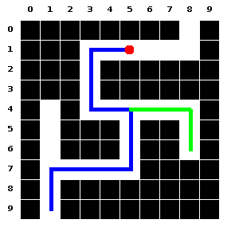

# Background

Mazes have fascinated people since ancient times, and extensive research has been undertaken to develop cutting-edge maze-solving algorithms that are faster or use lesser resources. The popular micromouse competitions since the late 1970s [@MicromouseHistory:2010] have provided much of the push behind such research. With each year, the competition is fiercer as new cutting-edge maze solving algorithms are invented.

# Statement of Need

A typical problem in describing a new maze-solving algorithm in a journal article is to actually generate the maze image. Although random maze generators are widely available, often a paper needs to describe a new algorithm that optimizes certain types of paths and loops in a maze. In such cases, we need to have precise control over how the maze looks. Moreover, the paths taken by a robot (or solver) also needs to be marked out (e.g. see [@Gupta:2014]). To generate such images, the researcher needs to either painstakingly draw it or write a program to do so, both of which are time-consuming and tedious. Even if such an image could be generated for journal articles, they can not be shared among researchers so that they may try their own solvers on them, because these images cannot be readily converted into program-readable mazes. To solve the aforesaid problems, we have developed a markup language called Maze Description Language (MDL), which is human-readable yet terse.

# Summary

 With MDL-Suite, mazes can be easily described with minimal code, and visited paths can be marked out. Multiple visited paths can also be marked using separate colors. The mazes are fully customizable and a path-based description allows manual maze design very easy. The MDL suite contains two programs: a MDL compiler and a MDL generator. 

The **MDL generator** is a random maze generator that, given the maze specifications, generates a random maze in MDL format.

The **MDL compiler** compiles code written in MDL, either manually written or generated using the MDL generator, into one of many output formats. The mazes can be compiled into images (jpg, png, tiff, bmp) or they can directly be converted into code for 2D arrays (int, boolean, char) for quick prototyping in Python or Java. 

The MDL suite is a command-line utility written in Java and hence, requires a JVM to be installed in order to use it.

# Key Features

1. The maze design is fully customizable with a number of options for setting colors, grids, coordinates, and cell-sizes.

1. Paths can be described minimally with a number of shorthands available, useful for manual maze design. Alternately, mazes can also be described row-wise, useful for algorithmically generated mazes. 

1. Both generation and compilation commands require no complicated options or arguments except the input files and are therefore, very easy to use. Furthermore, both tools support multiple maze generation/compilation with a single command. 

1. The MDL-format files are small text files and hence can be easily shared among researchers for collaboration. They can also be edited and/or converted to Java/Python code, or images using only a text-editor.

1. Research articles often require resizing images for better fit/placement and adjusting maze sizes (and hence image resolution) is quick and easy.

1. Multiple paths can be marked out in separate colors, and even sprites (images) can be used for marking those paths or the current position of the solver.

# Examples

Below we see a manually generated maze with only 12 lines of MDL code (and compiled with the MDL compiler into `png`):

The figure shows 2 separate paths taken by the solver (shown in blue and green) as well as the current position of the solver (shown in red). The paths and markers shown above are very useful in papers describing the progress of a maze-solver during its course of exploring the maze. Below we see a typical random 20x20 maze generated with the MDL generator (and then compiled using the compiler):

# Future Scope

The MDL suite is open source and can be easily extended to develop a GUI application that provides live preview. That will make the maze design process extremely smooth and fast.

# Acknowledgements

We acknowledge Susmita Guha for her contributions to this project.

# References